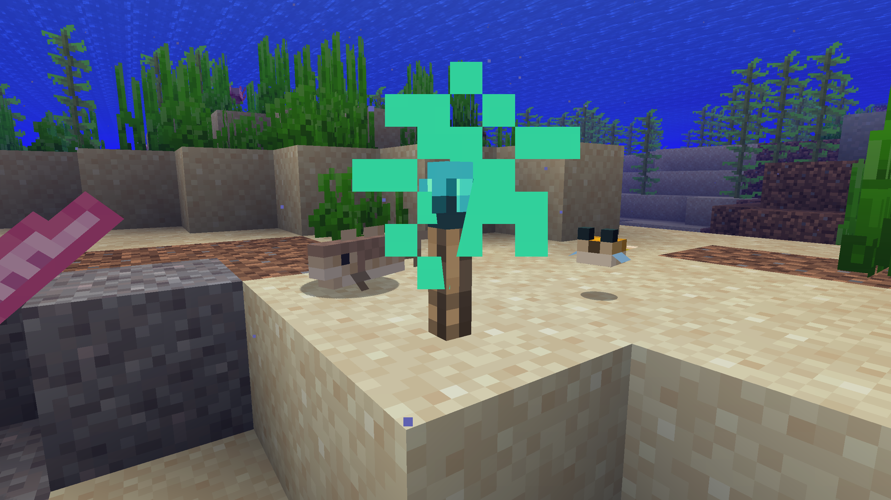

# Aquatic Torches

### No more dark oceans

Ever wondered what to do with glowing ink sacs aside from glowing item frames? Aquatic Torches adds **waterproof torches** to the game, which can be used just like normal, coal-fired torches but underwater.

Slightly brighter at light level 15, Aquatic Torches enable you to illuminate the entrance of your underwater bases and bring light to the vast darkness of the oceans.

It's available for Forge on 1.17 and 1.18. A Fabric port is planned.

## Recipe
